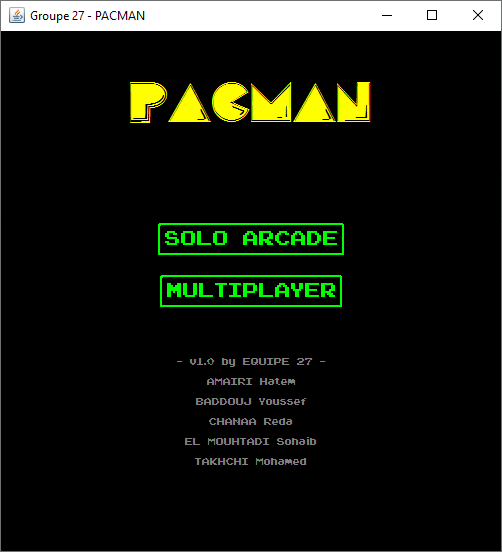
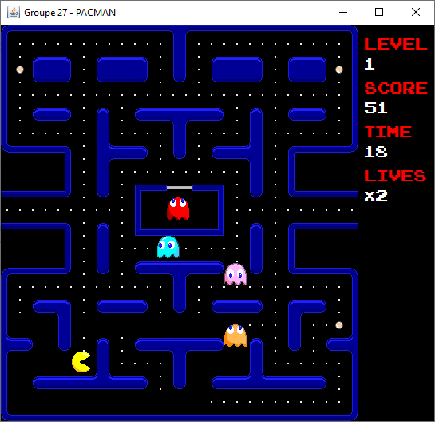
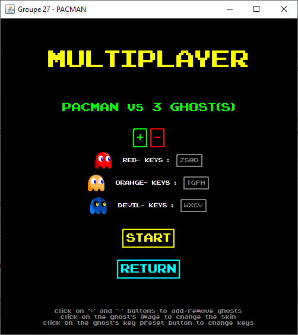

## Description

Jeu classique PACMAN avec un mode histoire, divers boss et un mode multijoueur local.
realisé dans le cadre d'un projet pour l'UE Génie Logiciel (M1) à Aix-Marseille Université.

## Captures d'écran

